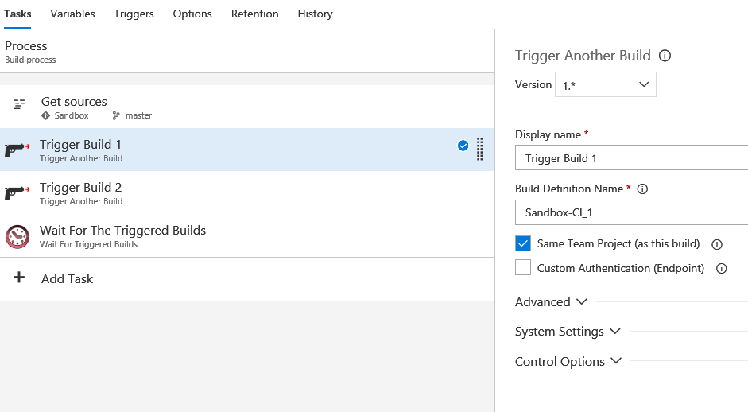
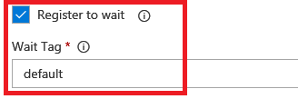
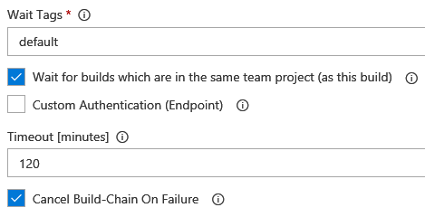

# Build Chain Tasks #

This is an extension for VSTS build system which includes tasks that help you or your team to chain builds within VSTS. 
It make use of VSTS API to queue build definitions and wait for them (within the same team project or even across projects). 
This extension provides the following features:

- Trigger build definitions across team projects with specific variables and on specific Agent according to capabilities (demands).  
- Trigger the builds with Changeset\Shelveset.
- Multiple triggers according to multiple values of parameters (you can trigger and test range of values on each Agent which meets a specified demands). 
- Wait for the triggered build or bind builds in groups and wait for build chain according to custom tag.
- Fail the main build and cancel the triggered builds (the build chain) upon failure of master.
- Display the errors of the child builds in the main build which contains the trigger task.
- Link triggered builds to triggering build (link on parent and child side).
- Set Agent Capabilities (can be set according to build status capabilities on failure and capabilities on success).
- Disable Agent (on build failure).
- Get Build Artifact.

## Supported Versions ##

The build tasks are supported for both VSTS and TFS on-Premises from Version 2015 Update 2 updwards.

## Release Notes ##

The tasks are written in Node.js and thus supports Windows and Linux as well.

## Trigger Another Build ##

1. Add the task to your build.
2. Provide the **definition name** of the build you would like to trigger.
3. If the build to trigger exists in the same team project then leave the checkbox **Same Team Project (as this build)** checked, otherwise uncheck and provide full URL of the team project which hold the build to be triggered.
4. Keep the checkbox **Custom Authentication** unchecked to use the system bearer token authorization or you can checked it and provide username and password via service endpoint.
5. Expand the **Advanced** section for more settings:
	- **Trigger With Changeset:** If this option is enabled, the triggered build will use the same source version as the build that includes the task, which means if the build was triggered for a specific changeset or label, the same source version will used in the triggered build. This option is disabled by default and the triggered build run on latest sources.
	- **Trigger With Shelveset:** If this is enabled, the triggered build will use the same source branch as the build that includes the task. This means if the build is triggered for the source branch refs/heads/master, the triggered build will as well. if this option is enabled then you need to make sure that the triggered build can actually be triggered for that branch.
	- **Custom Source Branch:** Specify branch for the triggered build, for example: refs/heads/master. Keep it empty to use default.
	- **Parameters:** A comma-delimited list of parameters in the form of param1=value1;param2=value2;... this parameters will be sent to the triggered build as variables. Those variables can be used on the triggered build, for example if you defined on the current build variable called release_version and you want to trigger child build with this parameter then you can pass it on this field " release_version=$(release_version)" and reuse it on the triggered build.
	- **Triggered Build ID Variable:** Specify build variable that will hold the Build ID of the triggered build (name only without $). Keep it empty if it not needed.
	- **Demands:** A comma-delimited list of demands in the form of capability1=value1;capability2=value2;... for example: git=2.12;cmake:3.9.2. Depending on your build definition demands that are required from the agent. When queuing a build additional demands can be specified, for example to filter for a special build agent.
	- **Multiple Triggers:** Enable this option to execute multiple triggers of the same build according to multiple values of parameters. This could be used for testing build with different numerical values.
	- **Multipliers Params (numerical values):** A list of comma separated parameters with range of values (those parameters values are inputs for the triggered build variables). For example: param1=1-2;param2=3-4 triggers the selected build with each value of the parameters (4 triggers while the triggered build got param1 with 1,2 and param2 with 3,4).
	- **Trigger the values range on each Agent from the Pool:** By enabling this option the build will be triggered on each Agent which meets the specified demands with each value of the parameters within the specified range. Keep it disabled to trigger range of the parameter values on Agents according to availability in Pool, if large range specified than the available Agents, some values will wait until an Agent completes running a previously assigned value. 
	- **Wait for completion:** If you enable this option, the build task will wait for the completion of the triggered build, the task checks the triggered build and continue only if it finished, therefore if you don't have an additional available build agent you will get stuck, as the original build is waiting for the completion of the other build, which can only be started once the original build is finished. Also make sure to set timeout for the wait.
	- **Register to wait:** Once this checked the triggered build will be added into wait list (this list will be used by the step "Wait For Triggered Builds"). **This feature allows you to create group of builds which is list of triggered builds.**
	- **Wait Tag:** Specify a custom tag which is label for the list of the triggered builds to be used by the wait step "Wait For Triggered Builds", the tags binding the triggered builds into groups and the step "Wait For Triggered Builds" can wait for a specif group of builds.
6. Expand the "System Settings" if the Agent is behind a proxy, this needed if you don't had environment variables on the host and you are behind a proxy then the task will need to know about the proxy settings.

## Wait For Triggered Builds ##

1. Add the task to your build.
2. Provide the **Wait Tags** which is a comma-delimited list of tags for example: default,chain1,chain2. If you triggered some builds using the parent task and you used the option **Register to wait** then here you can select the wait lists or the triggered builds groups (according to custom tag) for the wait process. 
3. **Wait for builds which are in the same team project (as this build)**, otherwise uncheck and provide full URL of the team project which holds the triggered builds.
4. Keep the checkbox **Custom Authentication** unchecked to use the system bearer token authorization or you can checked it and provide username and password via service endpoint.
5. Specify the **Timeout [minutes]** for the wait process, an empty or zero value indicates an infinite timeout.
6. **Cancel Build-Chain On Failure:** Set this to true for canceling the build-chain if error occurred on any child build (build-chain or wait-list is list of triggered builds which registered for the wait process by custom tag).
7. Expand the "System Settings" if the Agent is behind a proxy, this needed if you don't had environment variables on the host and you are behind a proxy then the task will need to know about the proxy settings.

## Get Build Artifacts ##

This task used for getting URL of any build Artifacts into build variable.  

1. Add the task to your build.
2. Provide the **Build Definition Name** of the build that you need it's Artifacts.
3. Set **Artifact Path Variable** which is build variable name (name only without $) to hold the path of the found Artifact.
4. Provide the **Artifact Name**, it's the name of the Artifact that stored on the selected build. Keep it empty to get first Artifact.
5. Keep the checkbox **latestSucceeded** checked to get Artifacts from latest succeeded build, otherwise it will bring the Artifacts from latest build.
6. Expand the "System Settings" if the Agent is behind a proxy, this needed if you don't had environment variables on the host and you are behind a proxy then the task will need to know about the proxy settings.

## Set Agent Capabilities (Demands) ##

This task add\modify demand of Agent, it also update the demand according to the status of the running build.

1. Add the task to your build.
2. Provide the **Capabilities** which can be single capability or list of capabilities in the form of capability1=value1;capability2=value2;
3. There's a special checkbox called **Capabilities by build status** to set capabilities according to the build result and it used to set **Capabilities On Success** and **Capabilities On Failure** of build. 
4. Keep the checkbox **Custom Authentication** unchecked to use the system bearer token authorization or you can checked it and provide username and password via service endpoint.
5. Expand the "System Settings" if the Agent is behind a proxy, this needed if you don't had environment variables on the host and you are behind a proxy then the task will need to know about the proxy settings.

## Disable Agent ##

This task disable the Agent if any error occurred during the build to prevent from other builds running on the Agent,  
it useful for debugging issues on the host on build failure.  

- Keep the checkbox **Custom Authentication** unchecked to use the system bearer token authorization or you can checked it and provide username and password via service endpoint.
- Expand the "System Settings" if the Agent is behind a proxy, this needed if you don't had environment variables on the host and you are behind a proxy then the task will need to know about the proxy settings.

## Best Practice ##

Trigger your builds with the task **"Trigger Another Build"**, 
Create group of triggered builds by register them to the wait process with custom tag and wait for them using **"Wait For Triggered Builds"** :

**Register to wait:**

**Wait Options:**
* You can choose to cancel the build chain if any error occurred on the child builds (the triggered builds which are within the same tag)
* Specify the timeout, if it reached then it fail the step. An empty or zero value indicates an infinite timeout.

