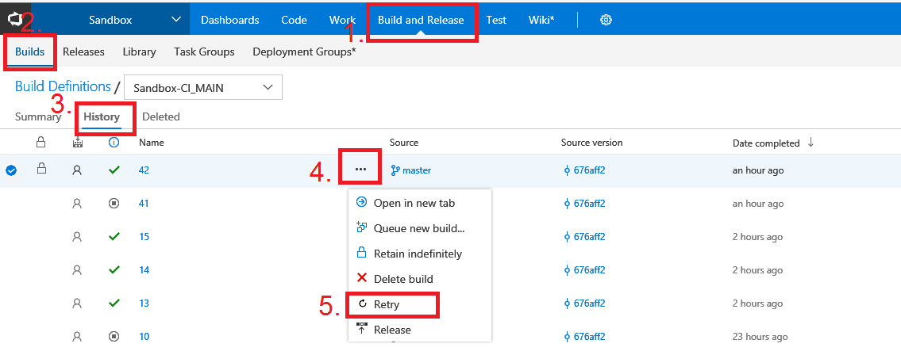

# Retry Build #

With this extension you can enjoy re-triggering builds which already completed (instead of queue the build and select the same parameters\variables or source version).
This feature was part of TFS but Microsoft removed it because it was implemented on the pull request.
The feature useful if the build failed because of unknown reason like infrastructure issue and you want to retry it with the same parameters.

## How it works ##
Navigate to the completed Builds and then History, select the build that you want to retry and click on the button ... (next to the build):

